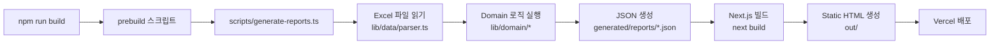

# RE:ACTION 코드 아키텍처 문서

> **버전**: 1.1  
> **최종 수정**: 2026-01-22  
> **작성일**: 2026-01-22  
> **대상**: 개발팀  
> **목표**: Next.js App Router + Static Export 기반 MVP 데모 사이트 구축  
> **참조**: [plan.md](plan.md), [wireframes.md](wireframes.md), [design-guide.md](design-guide.md)

---

## 문서 업데이트 로그

### v1.1 (2026-01-22)
- **빌드 파이프라인 정리**: prebuild 중복 실행 제거, 표준 실행 커맨드 확정
- **Static Export 프리뷰**: `next start` → `serve out` 방식으로 변경
- **Next.js App Router 타입 표준화**: params 타입 통일, notFound() 처리 추가
- **Tailwind v4 정합성**: globals.css 엔트리 방식 명확화
- **generated/ 가드 로직**: dev 시작 시 자동 prebuild, loader 에러 처리 추가
- **미구현 함수 정리**: TODO 목록으로 체계화
- **반응형 토큰 일관성**: design-guide.md 토큰과 Container 통합
- **실행 커맨드 3줄 추가**: 개발/빌드/프리뷰 표준화

### v1.0 (2026-01-22)
- 최초 작성

---

## 문서 목적

본 문서는 RE:ACTION 서비스의 코드 아키텍처를 정의하며, **개발자가 그대로 구현해도 삐끗하지 않도록** 제약사항, 결정사항, 근거를 명확히 기술합니다. 특히 Static Export 환경에서의 제약, 빌드 파이프라인, 반응형 전략을 아키텍처 수준에서 명시합니다.

**v1.1 핵심 개선사항**:
- prebuild 중복 실행 제거 → 일관된 빌드 흐름
- Static Export 로컬 프리뷰 방식 명확화
- generated/ 미존재 시 안전장치 추가
- 실무 표준 코드 패턴 적용

---

## 목차

1. [기술 스택 및 버전 관리](#1-기술-스택-및-버전-관리)
2. [핵심 제약사항](#2-핵심-제약사항)
3. [디렉토리 구조](#3-디렉토리-구조)
4. [빌드 파이프라인](#4-빌드-파이프라인)
5. [데이터 플로우](#5-데이터-플로우)
6. [라우팅 & 렌더링](#6-라우팅--렌더링)
7. [반응형 아키텍처](#7-반응형-아키텍처)
8. [컴포넌트 설계 규칙](#8-컴포넌트-설계-규칙)
9. [상태 관리](#9-상태-관리)
10. [접근성](#10-접근성)
11. [테스트 전략](#11-테스트-전략)
12. [배포](#12-배포)
13. [개발 체크리스트](#13-개발-체크리스트)

---

## 1. 기술 스택 및 버전 관리

### 1.1 기술 스택 (작성일 2026-01-22 기준)

본 프로젝트는 아래 기술 스택을 **예시 버전**으로 제시하며, 실제 설치 시점의 **stable 버전**을 확인하여 사용합니다.

| 기술 | 예시 버전 | 역할 | 비고 |
|------|----------|------|------|
| **Next.js** | 15.5.9 | 프레임워크 (App Router) | LTS 버전, Static Export 지원 |
| **React** | 19.2.0 | UI 라이브러리 | React Compiler 포함 |
| **TypeScript** | 5.9.3 | 타입 시스템 | TypeScript 7은 2026년 초 출시 예정 |
| **TailwindCSS** | 4.1.18 | 스타일링 | CSS-first 설정 |
| **xlsx** | 0.18.5 | Excel 파싱 | SheetJS 라이브러리 |
| **Pretendard** | latest | 폰트 | next/font/local로 자체 호스팅 |

### 1.2 버전 고정 전략 (package.json)

**Decision: 왜 정확한 버전 고정인가?**
- **리스크**: `^15.5.9` 같은 캐럿(^) 범위는 마이너 업데이트 시 예상치 못한 breaking change 발생 가능
- **대안 1**: `~15.5.9` (패치만 허용) → 보안 패치는 반영되나 여전히 리스크 존재
- **대안 2**: 정확한 버전 고정 (권장) → 재현 가능한 빌드 보장
- **선택**: **정확한 버전 고정** (예: `"next": "15.5.9"`)

```json
// package.json 예시
{
  "dependencies": {
    "next": "15.5.9",
    "react": "19.2.0",
    "react-dom": "19.2.0",
    "tailwindcss": "4.1.18",
    "typescript": "5.9.3",
    "xlsx": "0.18.5"
  },
  "devDependencies": {
    "@types/node": "22.0.0",
    "@types/react": "19.0.0",
    "@types/react-dom": "19.0.0",
    "tsx": "^4.0.0"
  }
}
```

### 1.3 설치 시점 버전 확인 체크리스트

프로젝트 초기화 시 아래 체크리스트를 확인하세요:

- [ ] `npm info next version` → 최신 stable 확인
- [ ] `npm info react version` → React 19.x stable 확인
- [ ] `npm info tailwindcss version` → Tailwind v4.x stable 확인
- [ ] [Next.js 공식 문서](https://nextjs.org/docs) → `output: "export"` 지원 여부 확인
- [ ] [React 공식 블로그](https://react.dev/blog) → 19.x breaking changes 확인
- [ ] [Tailwind v4 마이그레이션 가이드](https://tailwindcss.com/docs/upgrade-guide) 확인

**주의**: 본 문서의 버전은 **예시**이며, 설치 시점의 stable 버전을 우선합니다.

---

## 2. 핵심 제약사항

### 2.1 Static Export 제약 (`output: "export"`)

**Decision: Static Export를 선택한 이유**
- **요구사항**: MVP는 3개 고정 가게 데모, 서버 불필요
- **장점**: 
  - 최고 성능 (모든 페이지가 정적 HTML)
  - Vercel CDN 엣지 캐싱
  - 인프라 비용 제로 (서버리스 함수 없음)
- **제약**: 아래 기능 사용 불가 (Next.js 공식 제약)

#### Static Export에서 사용 불가능한 기능

| 기능 | 제약 사유 | 대안 |
|------|----------|------|
| **Server Actions** | 서버 런타임 필요 | MVP는 정적 데모이므로 불필요 |
| **Dynamic Routes (ISR)** | 요청 시점 렌더링 | `generateStaticParams()`로 빌드 타임 생성 |
| **Middleware** | 서버 런타임 필요 | MVP는 미들웨어 불필요 |
| **Image Optimization** | 서버 최적화 | `images.unoptimized: true` 설정 |
| **API Routes** | 서버리스 함수 | MVP는 정적 JSON 사용 |
| **Rewrites/Redirects** | 서버 라우팅 | 클라이언트 라우팅만 |
| **Headers** | 서버 응답 헤더 | Vercel 설정으로 대체 가능 |

#### Static Export 설정

```typescript
// next.config.ts
import type { NextConfig } from 'next';

const nextConfig: NextConfig = {
  output: 'export',  // ✅ Static HTML 생성
  trailingSlash: true,  // ✅ /report/store-1/ → /report/store-1/index.html
  images: {
    unoptimized: true  // ✅ Image Optimization 비활성화
  }
};

export default nextConfig;
```

### 2.2 trailingSlash와 라우팅 규칙

**Decision: `trailingSlash: true`를 선택한 이유**
- **배경**: Static Export는 `/report/store-1` 경로를 `out/report/store-1.html`로 생성
- **문제**: Vercel은 디렉토리 구조(`/report/store-1/index.html`)를 선호
- **선택**: `trailingSlash: true` → `/report/store-1/` 형태로 URL 정규화
- **효과**: 
  - `out/report/store-1/index.html` 구조로 생성
  - Vercel CDN에서 깨끗한 URL (`/report/store-1/`)

**라우팅 규칙**:
```typescript
// ✅ 올바른 링크 방식 (trailingSlash: true)
<Link href="/report/store-1/">리포트 보기</Link>

// ❌ 잘못된 방식 (trailing slash 없음)
<Link href="/report/store-1">리포트 보기</Link>  // 리다이렉트 발생
```

### 2.3 빌드 타임 데이터 생성 제약

**Decision: prebuild 스크립트 분리 vs 통합**

| 요소 | 옵션 A: 분리 | 옵션 B: 통합 (선택) |
|------|-------------|-------------------|
| **prebuild** | 별도 스크립트 | `build` 안에 포함 |
| **build** | `next build`만 | `prebuild && next build` |
| **Vercel Command** | `npm run prebuild && npm run build` | `npm run build` |
| **장점** | 명시적 분리 | 단순, 중복 실행 방지 |
| **단점** | 수동 2단계 실행 가능성 | prebuild가 build에 의존 |

**선택 이유**: 
- **옵션 B** 선택 → `build` 스크립트 안에 prebuild 포함
- **리스크 방지**: 개발자가 `npm run build`만 실행해도 prebuild 자동 실행
- **Vercel 단순화**: Build Command가 `npm run build`만으로 충분
- **일관성**: dev/build 모두 prebuild 자동 실행

```json
// package.json 스크립트 (확정)
{
  "scripts": {
    "prebuild": "tsx scripts/generate-reports.ts",
    "build": "npm run prebuild && next build",
    "dev": "npm run prebuild && next dev --turbo",
    "preview": "npm run build && npx serve out",
    "lint": "next lint",
    "type-check": "tsc --noEmit"
  }
}
```

**프로세스**:
1. `npm run build` → prebuild 자동 실행 → `generated/reports/*.json` 생성 → Next.js 빌드 → `out/` 생성
2. `npm run dev` → prebuild 자동 실행 → dev 서버 시작
3. `npm run preview` → 빌드 후 정적 서버로 `out/` 프리뷰

---

## 3. 디렉토리 구조

### 3.1 전체 구조

```
wrtn_ai_project/
├── app/                          # Next.js 15 App Router
│   ├── layout.tsx               # 전역 레이아웃 (Container 강제)
│   ├── page.tsx                 # Screen 1: 데모 랜딩
│   ├── report/
│   │   └── [storeId]/
│   │       └── page.tsx         # Screen 2: 주간 리포트
│   └── feedback/
│       └── [storeId]/
│           └── page.tsx         # Screen 3: 피드백 설문
│
├── components/                   # 재사용 컴포넌트
│   ├── ui/                      # 디자인 시스템 컴포넌트 (design-guide.md 기반)
│   │   ├── AppHeader.tsx
│   │   ├── Hero.tsx
│   │   ├── StoreCard.tsx
│   │   ├── ActionCard.tsx
│   │   ├── PriorityChip.tsx
│   │   ├── AccordionTrigger.tsx
│   │   ├── EmptyState.tsx
│   │   ├── FeedbackButtons.tsx
│   │   └── Container.tsx        # 반응형 컨테이너 (max-width 규칙)
│   └── report/                  # 리포트 도메인 컴포넌트
│       ├── CategoryDetail.tsx
│       └── WeeklySummary.tsx
│
├── lib/                          # 도메인 로직 & 유틸리티
│   ├── data/                    # Data Layer (입출력)
│   │   ├── parser.ts            # Excel → Raw JSON 변환
│   │   └── loader.ts            # Generated JSON 읽기
│   │
│   ├── domain/                  # Domain Layer (비즈니스 로직)
│   │   ├── classifier.ts        # classifyCategory() - 카테고리 분류
│   │   ├── sentiment.ts         # analyzeSentiment() - 긍정/부정 판단
│   │   ├── priority.ts          # scorePriority() - 우선순위 계산
│   │   └── actions.ts           # matchActions() - 액션 제안 매칭
│   │
│   ├── types/                   # TypeScript 타입 정의
│   │   ├── review.ts            # Review, RawReview
│   │   ├── report.ts            # WeeklyReport, ActionCard
│   │   └── action.ts            # ActionItem, ActionBank
│   │
│   └── utils/                   # 유틸리티
│       ├── date.ts              # 날짜 포맷팅
│       └── constants.ts         # 상수 (STORE_IDS, STORE_CONFIG 단일 소스)
│
├── scripts/                      # 빌드 스크립트 (prebuild)
│   └── generate-reports.ts      # Excel → JSON 생성 파이프라인
│
├── public/                       # 정적 자산
│   └── fonts/
│       └── Pretendard/
│           ├── Pretendard-Regular.woff2
│           └── Pretendard-Bold.woff2
│
├── data/                         # 원본 Excel 데이터 (Git 포함)
│   ├── 달떡볶이_공릉점.xlsx
│   ├── 처갓집양념치킨_공릉점.xlsx
│   └── 춘리마라탕_묵동점.xlsx
│
├── generated/                    # 빌드 타임 생성 JSON (Git 무시)
│   └── reports/
│       ├── store-1.json         # 달떡볶이 주간 리포트
│       ├── store-2.json         # 처갓집양념치킨 주간 리포트
│       └── store-3.json         # 춘리마라탕 주간 리포트
│
├── styles/
│   └── globals.css              # Tailwind 엔트리 + 디자인 토큰
│
├── .gitignore                    # generated/ 무시
├── tailwind.config.ts            # Tailwind 확장 (컬러, 폰트)
├── tsconfig.json                 # TypeScript 설정
├── next.config.ts                # Next.js 설정 (output: export)
└── package.json                  # 의존성 & 스크립트
```

### 3.2 디렉토리 책임 분리

#### `lib/data/` (Data Layer)
- **책임**: 입출력 (Excel 읽기, JSON 쓰기/읽기)
- **순수성**: 부수효과 있음 (파일 시스템 접근)
- **주요 함수**:
  - `parseExcel(filePath: string): RawReview[]` - Excel 파싱
  - `loadReport(storeId: string): WeeklyReport` - JSON 읽기

#### `lib/domain/` (Domain Layer)
- **책임**: 비즈니스 로직 (순수 함수)
- **순수성**: 부수효과 없음 (테스트 용이)
- **주요 함수**:
  - `classifyCategory(content: string): Category` - 키워드 기반 분류
  - `analyzeSentiment(content: string, rating: number): Sentiment` - 감성 분석
  - `scorePriority(reviews: Review[]): PriorityScore` - 우선순위 계산
  - `matchActions(issue: Issue): ActionItem[]` - 액션 제안

**Decision: 왜 domain layer를 분리했는가?**
- **테스트 용이성**: 순수 함수는 입출력만 검증
- **재사용성**: 다른 데이터 소스(API, DB)로 교체 시에도 domain 로직 유지
- **명확한 책임**: parser는 "읽기만", classifier는 "분류만"

### 3.3 generated/ 디렉토리 가드 로직

**Decision: generated/ 미존재 시 안전장치**

| 상황 | 문제 | 해결책 |
|------|------|--------|
| **dev 시작** | JSON 없어서 빌드 실패 | dev 스크립트에 prebuild 포함 |
| **JSON 로드** | 파일 미존재 시 에러 | loader에서 명확한 안내 메시지 |
| **storeId 관리** | generateStaticParams와 불일치 | constants.ts로 단일 소스 관리 |

**구현 규칙**:

1. **dev 스크립트 자동 prebuild** (package.json)
```json
{
  "scripts": {
    "dev": "npm run prebuild && next dev --turbo"
  }
}
```

2. **loader 에러 처리** (lib/data/loader.ts)
```typescript
export function loadReport(storeId: string): WeeklyReport {
  const filePath = path.join(process.cwd(), 'generated', 'reports', `${storeId}.json`);
  
  if (!fs.existsSync(filePath)) {
    throw new Error(
      `❌ 리포트 파일을 찾을 수 없습니다: ${storeId}.json\n` +
      `💡 해결 방법: npm run prebuild를 먼저 실행하세요.`
    );
  }
  
  const content = fs.readFileSync(filePath, 'utf-8');
  return JSON.parse(content);
}
```

3. **단일 소스 상수** (lib/utils/constants.ts)
```typescript
// STORE_IDS를 scripts/generate-reports.ts와 generateStaticParams()에서 공유
export const STORE_IDS = ['store-1', 'store-2', 'store-3'] as const;
export const STORE_CONFIG = [
  { id: 'store-1', name: '달떡볶이 공릉점', file: '달떡볶이_공릉점.xlsx' },
  { id: 'store-2', name: '처갓집양념치킨 공릉점', file: '처갓집양념치킨_공릉점.xlsx' },
  { id: 'store-3', name: '춘리마라탕 묵동점', file: '춘리마라탕_묵동점.xlsx' }
] as const;
```

**효과**:
- dev 시작 시 자동으로 prebuild 실행 → JSON 생성
- loader 에러 메시지로 문제 해결 방법 명확히 안내
- storeId 추가/삭제 시 constants.ts만 수정

---

## 4. 빌드 파이프라인

### 4.1 파이프라인 흐름



### 4.2 prebuild 스크립트 (`scripts/generate-reports.ts`)

**핵심 파이프라인 (복붙 가능한 최소 예시)**:

```typescript
// scripts/generate-reports.ts
import * as fs from 'fs';
import * as path from 'path';
import { STORE_CONFIG } from '../lib/utils/constants';
import { parseExcel } from '../lib/data/parser';
import { classifyCategory } from '../lib/domain/classifier';
import { analyzeSentiment } from '../lib/domain/sentiment';
import { scorePriority } from '../lib/domain/priority';
import { matchActions } from '../lib/domain/actions';
import type { WeeklyReport, Review } from '../lib/types/report';

async function generateReports() {
  // 1. 출력 디렉토리 생성
  const outputDir = path.join(process.cwd(), 'generated', 'reports');
  if (!fs.existsSync(outputDir)) {
    fs.mkdirSync(outputDir, { recursive: true });
  }

  // 2. 각 가게별 리포트 생성
  for (const store of STORE_CONFIG) {
    const filePath = path.join(process.cwd(), 'data', store.file);
    
    // 2.1 Excel 파싱
    const rawReviews = parseExcel(filePath);
    
    // 2.2 Domain 로직 실행 (카테고리 분류 + 감성 분석)
    const reviews: Review[] = rawReviews.map(raw => ({
      ...raw,
      category: classifyCategory(raw.content),
      sentiment: analyzeSentiment(raw.content, raw.rating)
    }));
    
    // 2.3 우선순위 계산
    const priorities = scorePriority(reviews);
    
    // 2.4 액션 매칭
    const actionCards = priorities.map(priority => ({
      ...priority,
      actions: matchActions(priority.issue)
    }));
    
    // 2.5 리포트 조합 (TODO 함수들 참고)
    const report: WeeklyReport = {
      storeId: store.id,
      storeName: store.name,
      period: { start: '2026-01-12', end: '2026-01-18' },
      totalReviews: reviews.length,
      summary: '배달 시간 지연이 심각해요',  // TODO: generateSummary()
      priorities: {
        urgent: actionCards.filter(c => c.priority === 'urgent'),
        consider: actionCards.filter(c => c.priority === 'consider'),
        good: actionCards.filter(c => c.priority === 'good')
      },
      categoryDetails: [],  // TODO: generateCategoryDetails()
      badges: []  // TODO: generateBadges()
    };
    
    // 2.6 JSON 저장
    const outputPath = path.join(outputDir, `${store.id}.json`);
    fs.writeFileSync(outputPath, JSON.stringify(report, null, 2), 'utf-8');
    console.log(`✅ Generated: ${outputPath}`);
  }
}

generateReports().catch(console.error);
```

**TODO: 미구현 함수 목록**

| 파일 경로 | 함수 시그니처 | 설명 | 우선순위 |
|----------|--------------|------|---------|
| `lib/domain/priority.ts` | `groupByCategory(reviews: Review[]): Record<Category, Review[]>` | 카테고리별 리뷰 그룹화 | 높음 |
| `lib/domain/priority.ts` | `generateIssueName(category: Category, items: Review[]): string` | 이슈명 생성 (예: "배달 시간 지연") | 높음 |
| `lib/domain/summary.ts` | `generateSummary(priorities: PriorityScore[]): string` | 한 줄 요약 생성 | 중간 |
| `lib/domain/category.ts` | `generateCategoryDetails(reviews: Review[]): CategoryDetail[]` | 카테고리 상세 생성 | 중간 |
| `lib/domain/badges.ts` | `generateBadges(reviews: Review[]): Badge[]` | 배지 생성 (표본 부족 등) | 낮음 |

**구현 순서**:
1. `groupByCategory()` → 필수 (scorePriority에서 사용)
2. `generateIssueName()` → 필수 (scorePriority에서 사용)
3. `generateSummary()` → 중간 (리포트 상단 표시)
4. `generateCategoryDetails()` → 중간 (Screen 2 하단)
5. `generateBadges()` → 낮음 (신뢰도 표시)

### 4.3 빌드 명령 (확정)

```json
// package.json
{
  "scripts": {
    "prebuild": "tsx scripts/generate-reports.ts",
    "build": "npm run prebuild && next build",
    "dev": "npm run prebuild && next dev --turbo",
    "preview": "npm run build && npx serve out",
    "lint": "next lint",
    "type-check": "tsc --noEmit"
  },
  "devDependencies": {
    "@types/node": "22.0.0",
    "@types/react": "19.0.0",
    "@types/react-dom": "19.0.0",
    "serve": "^14.0.0",
    "tsx": "^4.0.0"
  }
}
```

**Decision: Static Export 로컬 프리뷰 방식**

| 방식 | 명령 | 적합성 | 비고 |
|------|------|--------|------|
| `next start` | ❌ | Static Export 부적합 | SSR/서버 모드 전용 |
| `serve out` | ✅ | 정적 서버 (권장) | HTML/CSS/JS만 서빙 |
| `python -m http.server` | ✅ | 대안 | Python 설치 필요 |

**선택**: `npx serve out` (Node.js 정적 서버)
- **이유**: Static Export(`out/`)는 정적 파일만 존재, 서버 런타임 불필요
- **장점**: 프로덕션 환경(Vercel CDN)과 동일한 방식
- **설치**: `npm install -D serve`

**표준 실행 커맨드 (팀 표준)**:
```bash
# 1. 개발 (dev 서버 + HMR)
npm run dev

# 2. 프로덕션 빌드 (Static Export → out/)
npm run build

# 3. 빌드 결과 로컬 프리뷰 (정적 서버)
npm run preview
```

**로컬 개발 시**:
1. `npm run dev` → prebuild 자동 실행 → `generated/reports/*.json` 생성 → dev 서버 시작
2. Excel 수정 시 → 서버 재시작 (`Ctrl+C` → `npm run dev`)
3. 프리뷰 확인 → `npm run preview` (포트: http://localhost:3000)

**Vercel 배포 시**:
- Build Command: `npm run build` (prebuild 자동 포함)
- Output Directory: `out`
- Install Command: `npm install`

---

## 5. 데이터 플로우

### 5.1 Excel → JSON → HTML 플로우

```mermaid
graph TD
    A[Excel 파일<br/>data/*.xlsx] -->|parseExcel| B[RawReview[]]
    B -->|classifyCategory| C[Review[] + category]
    C -->|analyzeSentiment| D[Review[] + sentiment]
    D -->|scorePriority| E[PriorityScore[]]
    E -->|matchActions| F[ActionCard[]]
    F -->|조합| G[WeeklyReport]
    G -->|JSON.stringify| H[generated/reports/*.json]
    H -->|fs.readFileSync| I[Next.js Page]
    I -->|SSG| J[out/*.html]
```

### 5.2 Domain 함수 인터페이스

#### `lib/domain/classifier.ts`
```typescript
// 키워드 기반 카테고리 분류
export function classifyCategory(content: string): Category {
  const keywords = {
    food: ['맛', '신선', '양', '재료', '소스', '튀김', '치킨'],
    delivery: ['배달', '시간', '늦', '빠르', '느리', '도착'],
    packaging: ['포장', '용기', '파손', '새', '국물'],
    price: ['가격', '비싸', '저렴', '비용', '할인'],
    etc: [] // 기타
  };
  
  // 우선순위: food > delivery > packaging > price > etc
  for (const [category, terms] of Object.entries(keywords)) {
    if (terms.some(term => content.includes(term))) {
      return category as Category;
    }
  }
  
  return 'etc';
}
```

#### `lib/domain/sentiment.ts`
```typescript
// 별점 + 키워드 기반 감성 분석
export function analyzeSentiment(content: string, rating: number): Sentiment {
  // 별점 기준: 1-2점 부정, 3점 중립, 4-5점 긍정
  if (rating <= 2) return 'negative';
  if (rating >= 4) return 'positive';
  
  // 3점 리뷰는 내용으로 판단
  const positiveKeywords = ['맛있', '좋', '친절', '빠르', '신선'];
  const negativeKeywords = ['별로', '늦', '식', '파손', '짜'];
  
  const positiveCount = positiveKeywords.filter(k => content.includes(k)).length;
  const negativeCount = negativeKeywords.filter(k => content.includes(k)).length;
  
  if (positiveCount > negativeCount) return 'positive';
  if (negativeCount > positiveCount) return 'negative';
  return 'neutral';
}
```

#### `lib/domain/priority.ts`
```typescript
// 우선순위 계산 (부정 비율 기반)
export function scorePriority(reviews: Review[]): PriorityScore[] {
  const grouped = groupByCategory(reviews);  // TODO: 구현 필요
  
  return Object.entries(grouped).map(([category, items]) => {
    const total = items.length;
    const negative = items.filter(r => r.sentiment === 'negative').length;
    const percentage = Math.round((negative / total) * 100);
    
    let priority: 'urgent' | 'consider' | 'good';
    if (percentage >= 30) priority = 'urgent';
    else if (percentage >= 15) priority = 'consider';
    else priority = 'good';
    
    return {
      category,
      priority,
      percentage,
      count: negative,
      issue: generateIssueName(category, items)  // TODO: 구현 필요
    };
  });
}

// TODO: 구현 필요
function groupByCategory(reviews: Review[]): Record<Category, Review[]> {
  // 카테고리별 리뷰 그룹화 로직
  return {} as any;
}

// TODO: 구현 필요
function generateIssueName(category: Category, items: Review[]): string {
  // 이슈명 생성 로직 (예: "배달 시간 지연")
  return '이슈명 생성 필요';
}
```

#### `lib/domain/actions.ts`
```typescript
// 액션 뱅크에서 매칭
export function matchActions(issue: string): ActionItem[] {
  const actionBank = {
    '배달 시간 지연': [
      { text: '피크타임 인력 추가', cost: '중', time: '짧', difficulty: '중' },
      { text: '배달 대행 추가', cost: '낮', time: '중', difficulty: '하' },
      { text: '피크타임 주문 중단', cost: '낮', time: '짧', difficulty: '하' }
    ],
    // ... 더 많은 이슈별 액션
  };
  
  return actionBank[issue] || [];
}
```

---

## 6. 라우팅 & 렌더링

### 6.1 페이지 구조 및 렌더링 전략

| 경로 | 파일 | 렌더링 | 설명 |
|------|------|--------|------|
| `/` | `app/page.tsx` | SSG | Screen 1: 데모 랜딩 (3개 가게 카드) |
| `/report/store-1/` | `app/report/[storeId]/page.tsx` | SSG | Screen 2: 주간 리포트 (달떡볶이) |
| `/report/store-2/` | `app/report/[storeId]/page.tsx` | SSG | Screen 2: 주간 리포트 (처갓집) |
| `/report/store-3/` | `app/report/[storeId]/page.tsx` | SSG | Screen 2: 주간 리포트 (춘리마라탕) |
| `/feedback/store-1/` | `app/feedback/[storeId]/page.tsx` | SSG | Screen 3: 피드백 설문 |

### 6.2 동적 경로 정적 생성 (`generateStaticParams`)

#### 단일 소스 상수 (lib/utils/constants.ts)

```typescript
// lib/utils/constants.ts
export const STORE_IDS = ['store-1', 'store-2', 'store-3'] as const;
export type StoreId = typeof STORE_IDS[number];  // 'store-1' | 'store-2' | 'store-3'

export const STORE_CONFIG = [
  { id: 'store-1', name: '달떡볶이 공릉점', file: '달떡볶이_공릉점.xlsx' },
  { id: 'store-2', name: '처갓집양념치킨 공릉점', file: '처갓집양념치킨_공릉점.xlsx' },
  { id: 'store-3', name: '춘리마라탕 묵동점', file: '춘리마라탕_묵동점.xlsx' }
] as const;
```

#### Next.js App Router 페이지 (표준 패턴)

```typescript
// app/report/[storeId]/page.tsx
import { notFound } from 'next/navigation';
import { loadReport } from '@/lib/data/loader';
import { STORE_IDS } from '@/lib/utils/constants';
import type { WeeklyReport } from '@/lib/types/report';

// ✅ Static Export용 경로 생성 (단일 소스 사용)
export async function generateStaticParams() {
  return STORE_IDS.map(storeId => ({ storeId }));
}

// ✅ 팀 표준 params 타입 (Next.js 15+)
interface ReportPageProps {
  params: Promise<{ storeId: string }>;
}

// ✅ Server Component (기본)
export default async function ReportPage({ params }: ReportPageProps) {
  const { storeId } = await params;
  
  // 1. storeId 유효성 검증
  if (!STORE_IDS.includes(storeId as any)) {
    notFound();  // 404 페이지로 리다이렉트
  }
  
  // 2. JSON 로드 (에러 처리는 loader에서)
  const report: WeeklyReport = loadReport(storeId);
  
  return (
    <main>
      <h1>{report.storeName} 주간 리포트</h1>
      {/* ... 리포트 렌더링 */}
    </main>
  );
}
```

#### loader 에러 처리 (lib/data/loader.ts)

```typescript
// lib/data/loader.ts
import * as fs from 'fs';
import * as path from 'path';
import type { WeeklyReport } from '@/lib/types/report';

export function loadReport(storeId: string): WeeklyReport {
  const filePath = path.join(process.cwd(), 'generated', 'reports', `${storeId}.json`);
  
  // 파일 미존재 시 명확한 에러 메시지
  if (!fs.existsSync(filePath)) {
    throw new Error(
      `❌ 리포트 파일을 찾을 수 없습니다: ${storeId}.json\n` +
      `💡 해결 방법: npm run prebuild를 먼저 실행하세요.`
    );
  }
  
  const content = fs.readFileSync(filePath, 'utf-8');
  return JSON.parse(content);
}
```

**주의사항**:
- `generateStaticParams()`는 빌드 타임에 실행 → 3개 경로를 정적 생성
- `STORE_IDS` 상수를 단일 소스로 사용 → `scripts/generate-reports.ts`와 동기화
- `notFound()` 처리 → 잘못된 storeId 접근 시 404 페이지
- loader 에러 처리 → `generated/` 미존재 시 안내 메시지

### 6.3 Server Component vs Client Component

**Decision: Server Component 우선 전략**

| 컴포넌트 타입 | 사용 조건 | 예시 |
|--------------|----------|------|
| **Server Component** | 기본 (데이터 렌더링) | `app/page.tsx`, `Hero`, `StoreCard` |
| **Client Component** | 인터랙션 필요 | `AccordionTrigger`, `FeedbackButtons` |

```tsx
// ✅ Server Component (기본)
// components/ui/Hero.tsx
export function Hero() {
  return <header>...</header>;
}

// ✅ Client Component (인터랙션)
// components/ui/AccordionTrigger.tsx
'use client';

import { useState } from 'react';

export function AccordionTrigger() {
  const [isOpen, setIsOpen] = useState(false);
  return <button onClick={() => setIsOpen(!isOpen)}>...</button>;
}
```

**Client Component 사용 규칙**:
1. `'use client'` 지시어를 파일 최상단에 명시
2. 최소 단위로 분리 (예: 전체 페이지가 아닌 버튼만)
3. Server Component에서 import 가능

---

## 7. 반응형 아키텍처

### 7.1 반응형 전략

**Decision: Container 강제 + Tailwind 유틸리티**
- **배경**: design-guide.md의 모바일(360px)-태블릿(768px)-데스크톱(1024px) 규칙
- **선택**: 전역 `Container` 컴포넌트로 max-width 일관성 보장

### 7.2 Container 컴포넌트 (design-guide.md 토큰 통합)

**Decision: 토큰 기반 vs 하드코딩**

| 방식 | 장점 | 단점 | 선택 |
|------|------|------|------|
| **하드코딩** (px-5, md:px-6) | Tailwind 직관적 | 토큰 변경 시 일괄 수정 불가 | ❌ |
| **토큰 기반** (px-[var(--space-container-padding)]) | 디자인 토큰 일관성 | Tailwind 클래스 장황 | ✅ 권장 |

**선택 이유**: design-guide.md의 `--space-container-padding`, `--container-*-max` 토큰과 일치

```tsx
// components/ui/Container.tsx
import { ReactNode } from 'react';

interface ContainerProps {
  children: ReactNode;
  className?: string;
}

export function Container({ children, className = '' }: ContainerProps) {
  return (
    <div className={`
      w-full
      mx-auto
      px-[var(--space-container-padding)]     /* 모바일: 20px */
      max-w-[var(--container-mobile-max)]     /* 모바일: 100% */
      md:px-[var(--space-l)]                  /* 태블릿: 24px */
      md:max-w-[var(--container-tablet-max)]  /* 태블릿: 640px */
      lg:px-[var(--space-xl)]                 /* 데스크톱: 32px */
      lg:max-w-[var(--container-desktop-max)] /* 데스크톱: 768px */
      ${className}
    `}>
      {children}
    </div>
  );
}
```

**globals.css 토큰 정의 (design-guide.md 동기화)**:
```css
:root {
  /* Container */
  --container-mobile-max: 100%;
  --container-tablet-max: 640px;
  --container-desktop-max: 768px;
  
  /* Spacing */
  --space-container-padding: 20px;
  --space-l: 24px;
  --space-xl: 32px;
}
```

### 7.3 전역 레이아웃에서 Container 강제

```tsx
// app/layout.tsx
import { Container } from '@/components/ui/Container';
import { Pretendard } from '@/lib/fonts';
import './globals.css';

export default function RootLayout({
  children
}: {
  children: React.ReactNode
}) {
  return (
    <html lang="ko" className={Pretendard.variable}>
      <body>
        <Container>
          {children}
        </Container>
      </body>
    </html>
  );
}
```

**효과**:
- 모든 페이지가 자동으로 Container 적용
- 페이지별로 max-width 중복 관리 불필요

### 7.4 디자인 토큰 + Tailwind 통합

**Decision: CSS 변수 선언 → Tailwind에서 참조**

#### `styles/globals.css` (Tailwind v4 CSS-first 확정)

**Decision: Tailwind v4 엔트리 방식 (공식 문서 기준)**

Tailwind v4는 CSS-first 설정을 권장하며, `@tailwind` 지시어와 `@layer`를 조합합니다.

```css
/* styles/globals.css */

/* 1. Tailwind 엔트리 (v4 표준) */
@tailwind base;
@tailwind components;
@tailwind utilities;

/* 2. 디자인 토큰 (design-guide.md 동기화) */
@layer base {
  :root {
    /* Typography Presets */
    --type-display-title: 700 32px/1.4 var(--font-pretendard);
    --type-h1: 700 24px/1.4 var(--font-pretendard);
    --type-h2: 700 20px/1.4 var(--font-pretendard);
    --type-large-body: 500 18px/1.5 var(--font-pretendard);
    --type-body: 400 16px/1.6 var(--font-pretendard);
    --type-caption: 400 14px/1.5 var(--font-pretendard);
    
    /* Colors */
    --color-urgent: #E53E3E;
    --color-urgent-bg: #FFF5F5;
    --color-consider: #DD6B20;
    --color-consider-bg: #FFFAF0;
    --color-good: #38A169;
    --color-good-bg: #F0FFF4;
    
    --color-text-primary: #1A1A1A;
    --color-text-secondary: #5A5A5A;
    --color-border-default: #E0E0E0;
    --color-border-focus: #4A90E2;
    
    /* Spacing (design-guide.md 토큰) */
    --space-xs: 4px;
    --space-s: 8px;
    --space-m: 16px;
    --space-l: 24px;
    --space-xl: 32px;
    --space-container-padding: 20px;
    
    /* Container (반응형) */
    --container-mobile-max: 100%;
    --container-tablet-max: 640px;
    --container-desktop-max: 768px;
    
    /* Radius */
    --radius-card: 12px;
    --radius-button: 24px;
    
    /* Shadow */
    --shadow-card: 0 2px 8px rgba(0, 0, 0, 0.08);
    --shadow-focus: 0 0 0 4px rgba(74, 144, 226, 0.3);
  }
  
  /* Base Styles */
  body {
    @apply text-[var(--color-text-primary)] antialiased;
    word-break: keep-all;  /* 한글 단어 단위 줄바꿈 */
    overflow-wrap: break-word;
  }
  
  h1 {
    font: var(--type-h1);
  }
  
  h2 {
    font: var(--type-h2);
  }
}

/* 3. 컴포넌트 스타일 (재사용) */
@layer components {
  .btn-primary {
    @apply px-6 py-3 bg-[var(--color-urgent)] text-white rounded-[var(--radius-button)];
    @apply hover:bg-[#C53030] transition-colors;
  }
  
  .card {
    @apply bg-white rounded-[var(--radius-card)] shadow-[var(--shadow-card)];
    @apply p-5 border border-[var(--color-border-default)];
  }
}
```

**v4 엔트리 규칙**:
1. `@tailwind` 지시어는 최상단에 선언
2. `@layer base`에서 CSS 변수 정의
3. `@layer components`에서 재사용 클래스 정의
4. Tailwind v3 문법(`@import`)은 사용하지 않음

#### `tailwind.config.ts` (확장 포인트)

```typescript
// tailwind.config.ts
import type { Config } from 'tailwindcss';

const config: Config = {
  content: [
    './app/**/*.{ts,tsx}',
    './components/**/*.{ts,tsx}'
  ],
  theme: {
    extend: {
      // CSS 변수를 Tailwind 유틸리티로 확장
      colors: {
        urgent: 'var(--color-urgent)',
        'urgent-bg': 'var(--color-urgent-bg)',
        consider: 'var(--color-consider)',
        'consider-bg': 'var(--color-consider-bg)',
        good: 'var(--color-good)',
        'good-bg': 'var(--color-good-bg)'
      },
      fontFamily: {
        sans: ['var(--font-pretendard)', 'system-ui', 'sans-serif']
      },
      borderRadius: {
        card: 'var(--radius-card)',
        button: 'var(--radius-button)'
      }
    }
  }
};

export default config;
```

#### 사용 예시

```tsx
// components/ui/ActionCard.tsx
export function ActionCard({ type }: { type: 'urgent' | 'consider' | 'good' }) {
  return (
    <article className={`
      card  // ← @layer components에서 정의
      ${type === 'urgent' ? 'border-urgent border-3 bg-urgent-bg' : ''}
      ${type === 'consider' ? 'border-consider border-2 bg-consider-bg' : ''}
      ${type === 'good' ? 'border-good border bg-good-bg' : ''}
    `}>
      {/* ... */}
    </article>
  );
}
```

**토큰 → Tailwind 흐름**:
1. `globals.css`에서 CSS 변수 선언
2. `tailwind.config.ts`에서 `theme.extend`로 유틸리티 확장
3. 컴포넌트에서 `className`으로 사용

---

## 8. 컴포넌트 설계 규칙

### 8.1 컴포넌트 분류

| 디렉토리 | 책임 | 예시 |
|---------|------|------|
| `components/ui/` | 디자인 시스템 (재사용) | `AppHeader`, `StoreCard`, `ActionCard` |
| `components/report/` | 도메인 특화 (리포트) | `CategoryDetail`, `WeeklySummary` |
| `app/` | 페이지 (라우팅) | `page.tsx`, `layout.tsx` |

### 8.2 Props 인터페이스 명명 규칙

```typescript
// ✅ 올바른 Props 명명
interface StoreCardProps {
  id: string;
  name: string;
  // ...
}

// ❌ 잘못된 Props 명명
interface IStoreCard {  // "I" 접두사 금지
  // ...
}

type StoreCardPropsType {  // "Type" 접미사 불필요
  // ...
}
```

### 8.3 주요 컴포넌트 Props 정의

#### `components/ui/StoreCard.tsx`
```typescript
interface StoreCardProps {
  id: string;              // store-1, store-2, store-3
  name: string;            // 달떡볶이 공릉점
  category: string;        // 치킨/튀김
  period: {
    start: string;         // 2026-01-12
    end: string;           // 2026-01-18
  };
  reviewCount: number;
  priorities: {
    urgent: number;
    consider: number;
    good: number;
  };
}
```

#### `components/ui/ActionCard.tsx`
```typescript
interface ActionCardProps {
  type: 'urgent' | 'consider' | 'good';
  category: string;        // "배달·서비스"
  issue: string;           // "배달 시간 지연"
  metric: {
    sentiment: '부정' | '긍정';
    percentage: number;    // 60
    count: number;         // 40
  };
  action: ActionItem;      // 추천 액션
  alternatives: ActionItem[];  // 대안 2개
  uniqueId: string;        // ARIA ID (store-1-action-1)
}

interface ActionItem {
  text: string;
  cost: '낮' | '중' | '높';
  time: '짧' | '중' | '김';
  difficulty?: '하' | '중' | '상';  // 대안에만 표시
}
```

### 8.4 ARIA ID 유니크성 규칙

**Decision: `{storeId}-{component}-{index}` 패턴**

```tsx
// ✅ 올바른 ARIA ID 패턴
<button
  aria-expanded={isOpen}
  aria-controls={`${storeId}-accordion-${index}`}
>
  대안 보기 ▾
</button>
<div
  id={`${storeId}-accordion-${index}`}
  role="region"
  hidden={!isOpen}
>
  {/* 내용 */}
</div>

// ❌ 잘못된 ARIA ID (중복 가능)
<button aria-controls="alternatives">대안 보기 ▾</button>
<div id="alternatives">...</div>
```

---

## 9. 상태 관리

### 9.1 상태 관리 전략

**Decision: 최소화 전략 (No Redux/Zustand)**
- **배경**: MVP는 3개 고정 가게, 정적 데이터
- **선택**: URL 상태 + 로컬 상태(useState)만 사용

### 9.2 상태 분류

| 상태 타입 | 저장 위치 | 사용 사례 |
|----------|----------|----------|
| **URL 상태** | `/report/[storeId]/` | storeId로 리포트 식별 |
| **로컬 상태** | `useState` | 아코디언 열림/닫힘, 라디오 버튼 선택 |
| **전역 상태** | 없음 | MVP는 불필요 |

### 9.3 Client Component 상태 예시

```tsx
// components/ui/AccordionTrigger.tsx
'use client';

import { useState } from 'react';

interface AccordionTriggerProps {
  target: string;  // "대안", "카테고리 상세"
  controlsId: string;
  children: React.ReactNode;
}

export function AccordionTrigger({
  target,
  controlsId,
  children
}: AccordionTriggerProps) {
  const [isExpanded, setIsExpanded] = useState(false);
  
  return (
    <>
      <button
        aria-expanded={isExpanded}
        aria-controls={controlsId}
        onClick={() => setIsExpanded(!isExpanded)}
        className="w-full py-3 px-5 hover:bg-gray-50"
      >
        {target} {isExpanded ? '접기 ▴' : '보기 ▾'}
      </button>
      <div
        id={controlsId}
        role="region"
        hidden={!isExpanded}
        className="transition-all duration-300"
      >
        {children}
      </div>
    </>
  );
}
```

---

## 10. 접근성

### 10.1 WCAG 2.1 AA 준수 체크리스트

#### 색상 대비 (4.5:1 최소)

- [ ] Primary Text (#1A1A1A) on White (#FFFFFF): 4.5:1 이상
- [ ] Urgent 칩 텍스트 (White) on Urgent (#E53E3E): 4.5:1 이상
- [ ] Consider 칩 텍스트 (White) on Consider (#DD6B20): 4.5:1 이상
- [ ] Good 칩 텍스트 (White) on Good (#38A169): 4.5:1 이상
- [ ] WebAIM Contrast Checker로 전체 조합 검증

#### 키보드 내비게이션

- [ ] 모든 인터랙티브 요소에 `:focus-visible` 스타일
- [ ] Tab 키로 순차 이동 가능
- [ ] Enter/Space 키로 버튼 활성화
- [ ] Esc 키로 아코디언 접기 (데스크톱 권장)

#### 터치 영역

- [ ] 버튼: 44×44px 이상
- [ ] 아코디언 트리거: 48×48px 이상
- [ ] 라디오 버튼: `<label>` 전체 44px

#### ARIA 속성

```tsx
// ✅ 올바른 ARIA 사용
<article aria-labelledby="store-1">
  <h3 id="store-1">달떡볶이 공릉점</h3>
  <button
    aria-expanded={isOpen}
    aria-controls="detail-1"
    aria-label="카테고리 상세 보기"
  >
    카테고리 상세 보기 ▾
  </button>
  <div
    id="detail-1"
    role="region"
    aria-labelledby="detail-heading-1"
    hidden={!isOpen}
  >
    <h4 id="detail-heading-1">카테고리 상세</h4>
    {/* 내용 */}
  </div>
</article>
```

### 10.2 시맨틱 HTML 규칙

| 요소 | 사용 조건 | 예시 |
|------|----------|------|
| `<article>` | 독립적 콘텐츠 | StoreCard, ActionCard |
| `<section>` | 주제별 그룹 | "먼저 고칠 일", "상세 분석" |
| `<h1>~<h6>` | 계층 구조 | 페이지당 `<h1>` 1개 |
| `<button>` | 인터랙션 | 아코디언, 설문 제출 |
| `<a>` | 네비게이션 | 페이지 이동 |

---

## 11. 테스트 전략

### 11.1 MVP 테스트 전략

**Decision: 수동 테스트 우선, 자동화는 Phase 2**

#### 필수 수동 테스트

- [ ] **크로스 브라우저**: Chrome, Safari, Firefox (최신 2버전)
- [ ] **반응형**: 360px, 768px, 1024px, 1920px
- [ ] **접근성**: 
  - VoiceOver (iOS/macOS)
  - TalkBack (Android)
  - 키보드 전용 내비게이션
- [ ] **색맹 시뮬레이션**: Deuteranopia, Protanopia
- [ ] **그레이스케일 변환**: Priority Chip 구분 확인

#### Phase 2 자동화 고려

- **E2E 테스트**: Playwright
  - 3개 가게 리포트 접근
  - 아코디언 펼침/접힘
  - 설문 제출 플로우

- **Unit 테스트**: Vitest
  - `classifyCategory()` 테스트
  - `analyzeSentiment()` 테스트
  - `scorePriority()` 테스트

---

## 12. 배포

### 12.1 Vercel 배포 설정

#### 프로젝트 설정
1. GitHub 저장소 연결
2. Framework Preset: **Next.js**
3. Build Command: `npm run build` (prebuild 자동 실행)
4. Output Directory: `out`
5. Install Command: `npm install`

#### 환경 변수 (필요 시)
```
# Vercel Dashboard → Settings → Environment Variables
NODE_ENV=production
```

### 12.2 성능 목표

| 지표 | 목표 | 측정 도구 |
|------|------|----------|
| **Lighthouse Performance** | 90+ | Chrome DevTools |
| **First Contentful Paint** | < 1.5s | Lighthouse |
| **Time to Interactive** | < 3.5s | Lighthouse |
| **Total Blocking Time** | < 300ms | Lighthouse |
| **Cumulative Layout Shift** | < 0.1 | Lighthouse |

### 12.3 배포 체크리스트

- [ ] `npm run build` 로컬 빌드 성공
- [ ] `generated/reports/*.json` 파일 생성 확인
- [ ] `out/` 디렉토리에 HTML 생성 확인
- [ ] Lighthouse 점수 확인 (모든 지표 90+)
- [ ] 반응형 테스트 (360px, 768px, 1024px)
- [ ] 접근성 검증 (axe DevTools)
- [ ] 크로스 브라우저 테스트
- [ ] Vercel Preview 배포 확인
- [ ] Production 배포

---

## 13. 개발 체크리스트

### Phase 1: 프로젝트 초기화

- [ ] Node.js 설치 확인 (v20+ 권장)
- [ ] `npm init` → package.json 생성
- [ ] Next.js, React, TypeScript 설치 (stable 버전 확인)
- [ ] TailwindCSS v4 설치 및 설정
- [ ] `next.config.ts` 설정 (`output: "export"`)
- [ ] `tsconfig.json` 설정
- [ ] `.gitignore` 설정 (`generated/`, `out/`, `node_modules/`)

### Phase 2: 디자인 시스템

- [ ] `styles/globals.css` 생성 (Tailwind 엔트리 + 토큰)
- [ ] `tailwind.config.ts` 확장 (컬러, 폰트)
- [ ] Pretendard 폰트 다운로드 → `public/fonts/`
- [ ] `lib/fonts.ts` 생성 (next/font/local)
- [ ] `Container` 컴포넌트 구현
- [ ] `app/layout.tsx` 생성 (전역 레이아웃)

### Phase 3: Data & Domain Layer

- [ ] `lib/types/` 타입 정의 (review.ts, report.ts, action.ts)
- [ ] `lib/data/parser.ts` 구현 (Excel → RawReview[])
- [ ] `lib/domain/classifier.ts` 구현 (카테고리 분류)
- [ ] `lib/domain/sentiment.ts` 구현 (감성 분석)
- [ ] `lib/domain/priority.ts` 구현 (우선순위 계산)
- [ ] `lib/domain/actions.ts` 구현 (액션 매칭)
- [ ] `scripts/generate-reports.ts` 구현 (파이프라인)
- [ ] `package.json` 스크립트 추가 (prebuild, build)
- [ ] `npm run prebuild` 테스트 → `generated/reports/*.json` 확인

### Phase 4: UI 컴포넌트

- [ ] `components/ui/AppHeader.tsx`
- [ ] `components/ui/Hero.tsx`
- [ ] `components/ui/StoreCard.tsx`
- [ ] `components/ui/PriorityChip.tsx`
- [ ] `components/ui/ActionCard.tsx`
- [ ] `components/ui/AccordionTrigger.tsx`
- [ ] `components/ui/EmptyState.tsx`
- [ ] `components/ui/FeedbackButtons.tsx`
- [ ] `components/report/CategoryDetail.tsx`
- [ ] `components/report/WeeklySummary.tsx`

### Phase 5: 페이지 구현

- [ ] `app/page.tsx` (Screen 1: 데모 랜딩)
- [ ] `app/report/[storeId]/page.tsx` (Screen 2: 리포트)
- [ ] `generateStaticParams()` 구현 (3개 경로)
- [ ] `app/feedback/[storeId]/page.tsx` (Screen 3: 설문)

### Phase 6: 접근성 & 테스트

- [ ] ARIA 속성 추가 (aria-label, aria-expanded, aria-controls)
- [ ] 키보드 내비게이션 테스트 (Tab, Enter, Space, Esc)
- [ ] 색상 대비 검증 (WebAIM Contrast Checker)
- [ ] 반응형 테스트 (360px, 768px, 1024px)
- [ ] 크로스 브라우저 테스트 (Chrome, Safari, Firefox)
- [ ] 스크린리더 테스트 (VoiceOver, TalkBack)
- [ ] Lighthouse 점수 확인 (90+ 목표)

### Phase 7: 배포

- [ ] Vercel 프로젝트 생성
- [ ] GitHub 저장소 연결
- [ ] Build Command 설정 (`npm run build`)
- [ ] Preview 배포 확인
- [ ] Production 배포
- [ ] 도메인 설정 (선택)

---

## 부록: 주요 결정사항 요약

### A. Static Export 선택 이유

| 요소 | 장점 | 단점 | 결론 |
|------|------|------|------|
| **Static Export** | 최고 성능, CDN 캐싱, 인프라 비용 제로 | 서버 기능 불가 | ✅ MVP에 적합 |
| **SSR** | 서버 기능 사용 가능 | 서버 비용, Cold Start | ❌ MVP에 불필요 |

### B. prebuild 스크립트 분리 이유

| 요소 | 리스크 | 해결책 |
|------|--------|--------|
| **빌드 중 파일 쓰기** | Next.js 빌드 실패 | prebuild 단계에서 별도 스크립트로 JSON 생성 |
| **데이터 로딩** | 빌드 타임마다 Excel 파싱 | 1회만 파싱 후 JSON 재사용 |

### C. Domain 로직 분리 이유

| 레이어 | 책임 | 테스트 용이성 |
|--------|------|---------------|
| **Data Layer** | 입출력 (Excel, JSON) | ❌ (부수효과) |
| **Domain Layer** | 비즈니스 로직 (순수 함수) | ✅ (입출력만 검증) |

### D. 반응형 Container 강제 이유

| 요소 | 문제 | 해결책 |
|------|------|--------|
| **페이지별 max-width** | 중복 관리, 일관성 부족 | 전역 Container로 강제 |
| **디자인 시스템** | Tailwind 유틸리티만으로는 일관성 보장 어려움 | CSS 변수 + Tailwind 조합 |

---

## 참고 문서

- [Next.js 15 공식 문서](https://nextjs.org/docs)
- [Static Export 가이드](https://nextjs.org/docs/pages/building-your-application/deploying/static-exports)
- [TailwindCSS v4 마이그레이션](https://tailwindcss.com/docs/upgrade-guide)
- [WCAG 2.1 Guidelines](https://www.w3.org/WAI/WCAG21/quickref/)
- [RE:ACTION 기획안](plan.md)
- [RE:ACTION 와이어프레임](wireframes.md)
- [RE:ACTION 디자인 가이드](design-guide.md)

---

## 팀 표준 실행 커맨드 (3줄)

```bash
# 개발: prebuild 자동 실행 → dev 서버 시작 (HMR 지원)
npm run dev

# 빌드: prebuild 자동 실행 → Static Export (out/ 생성)
npm run build

# 프리뷰: 빌드 후 정적 서버로 out/ 프리뷰 (프로덕션 확인)
npm run preview
```

**포트**:
- dev: http://localhost:3000
- preview: http://localhost:3000 (serve 기본 포트)

**주의사항**:
- Excel 수정 시: dev 서버 재시작 (`Ctrl+C` → `npm run dev`)
- `npm run build` 실패 시: `generated/reports/*.json` 파일 생성 확인
- `npm run preview` 404 에러: `out/` 디렉토리 존재 여부 확인

---

**문서 버전**: 1.1  
**최종 수정**: 2026-01-22  
**작성자**: 개발팀

**변경 이력**:
- v1.1: 빌드 파이프라인 정리, Static Export 프리뷰, params 타입 표준화, Tailwind v4 정합성, generated/ 가드 로직, TODO 정리
- v1.0: 최초 작성
